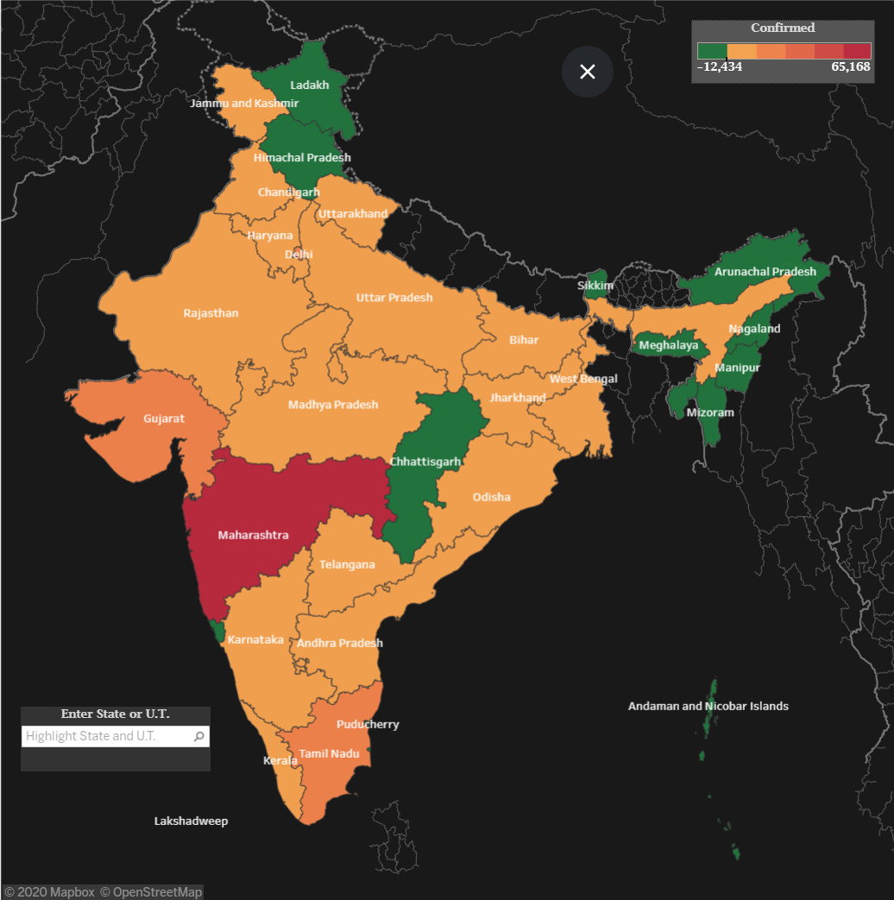
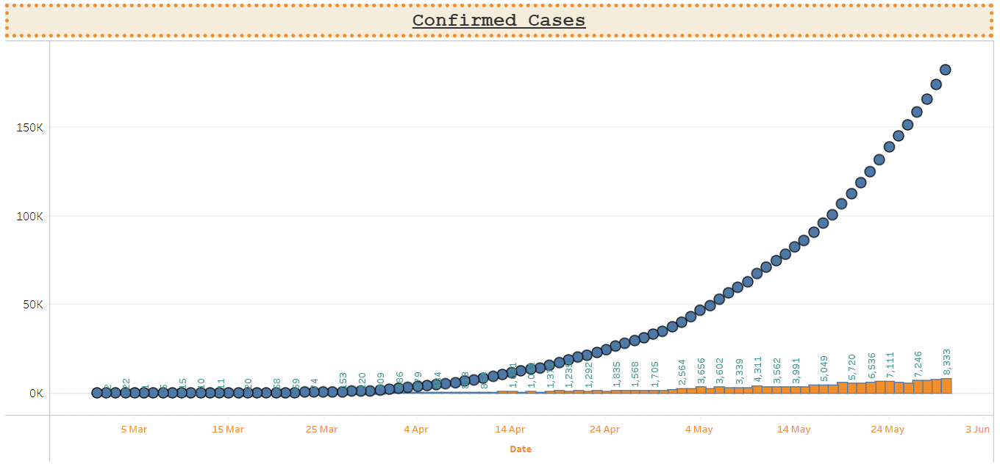
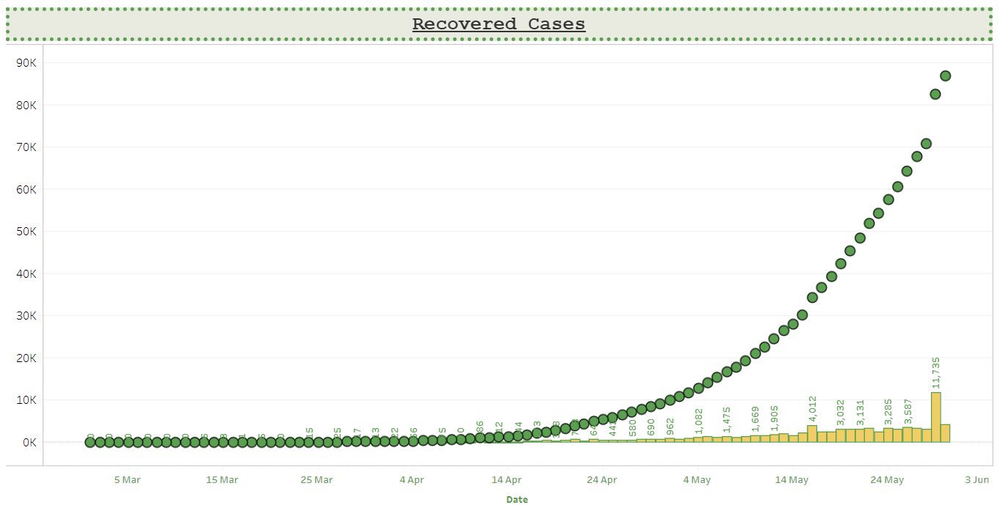
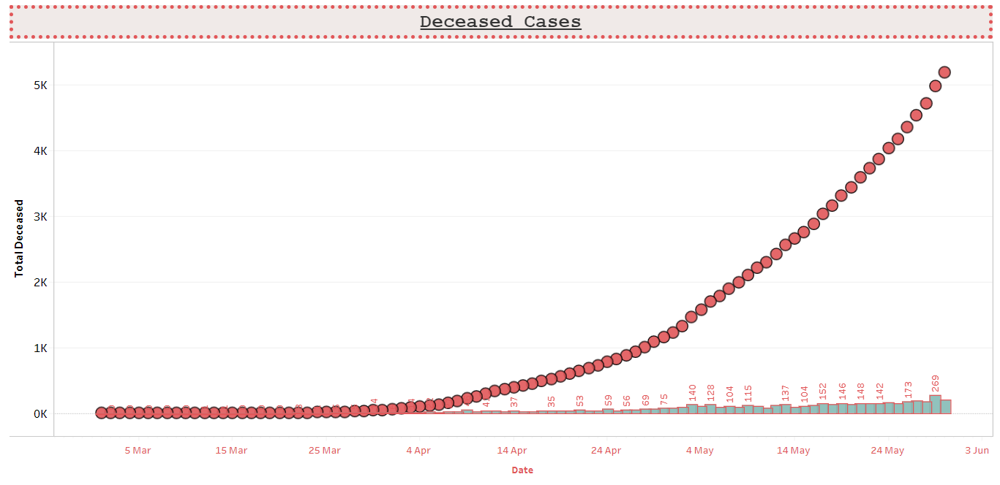
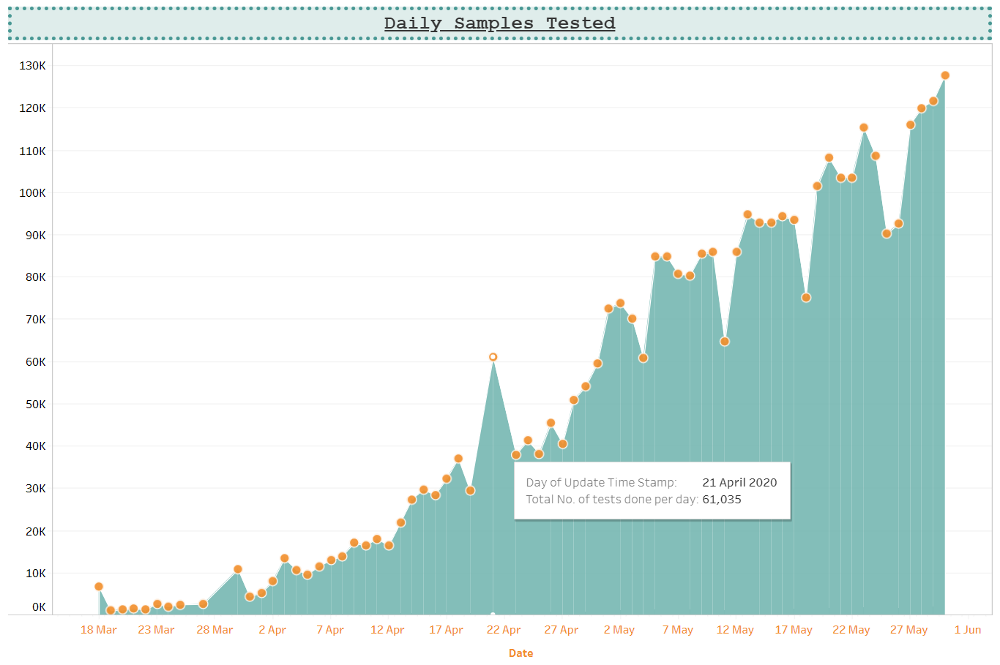
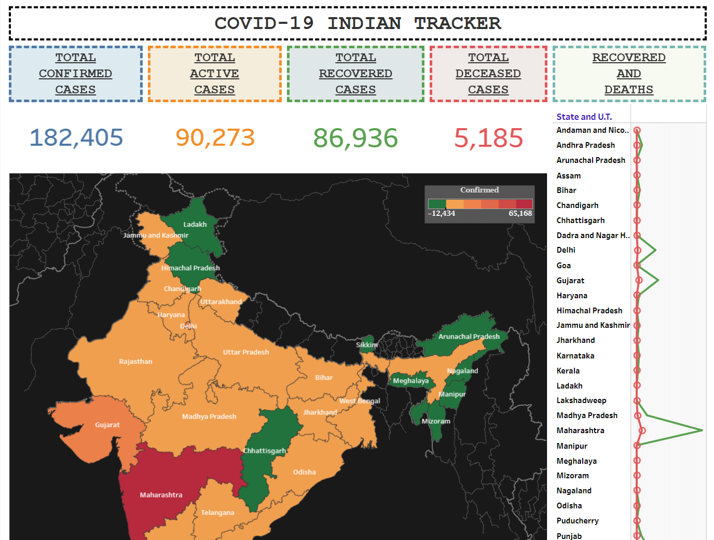

# COVID-19-INDIAN-TRACKER

This is a corona virus tracker for India. It includes state wise number of corona cases, daily number of corona cases reported, people recovered, people died and total number of corona test done per day. The tracker is made on tableau and is published on tableau server. The tableau dashboard is updated from google sheets. 

The data in the google sheets is updated from: https://api.covid19india.org/csv/ with the help of api. 

1. state_wise:	https://api.covid19india.org/csv/latest/state_wise.csv	The current statewise situation.

2. case_time_series:	https://api.covid19india.org/csv/latest/case_time_series.csv	Time series of Confirmed, Recovered and Deceased cases.

3. tested_numbers_icmr_data:	https://api.covid19india.org/csv/latest/tested_numbers_icmr_data.csv	Number of tests reported by ICMR.

The link for the tracker: https://public.tableau.com/views/Corona_India/Dashboard1?:display_count=y&:toolbar=n&:origin=viz_share_link

