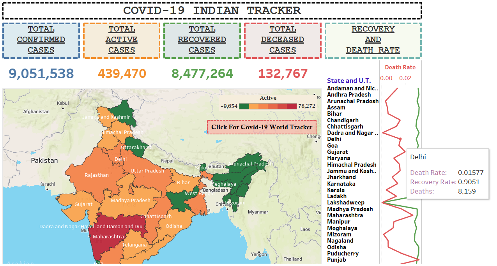

# COVID-19-INDIAN-TRACKER

This is a corona virus tracker for India. It includes state wise number of corona cases, daily number of corona cases reported, people recovered, people died and total number of corona test done per day. **It also forecast the possible no. of confirmed cases for the next few days automatically.** The tracker is made on tableau and is published on tableau server. The tableau dashboard is updated from google sheets.

**The link for the tracker:** https://public.tableau.com/views/Corona_India/Dashboard1?:display_count=y&:toolbar=n&:origin=viz_share_link

**The data in the google sheets is updated from:** https://api.covid19india.org/documentation/csv/ with the help of api.

 

1. **state_wise:**	https://api.covid19india.org/csv/latest/state_wise.csv	The current statewise situation. Clicking on any state or union territory will give you all the data related to it. As you can see in the pic.

2. **case_time_series:**	https://api.covid19india.org/csv/latest/case_time_series.csv	Time series of Confirmed, Recovered and Deceased cases. The dark orange dots show the actual no. of confirmed case on that particular date and the light orange shows the estimate of the no. of confirmed cases next few days.

3. **tested_numbers_icmr_data:**	https://api.covid19india.org/csv/latest/tested_numbers_icmr_data.csv	Number of tests reported by ICMR.

4. **Tabular form of state wise Confrimed, Active, Recovered and Death data:**

